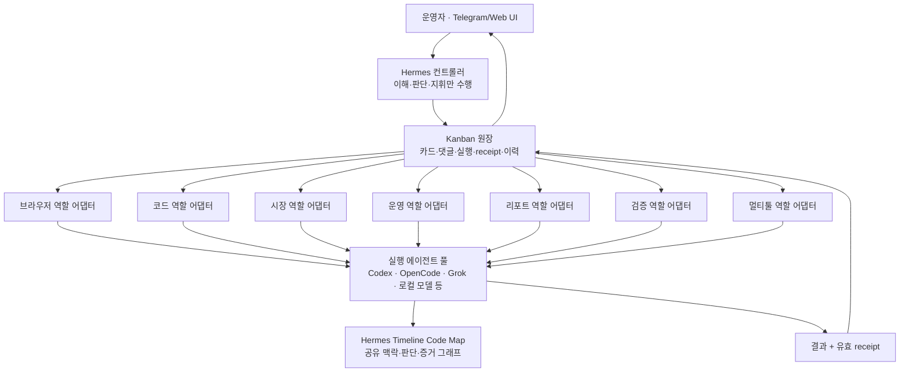
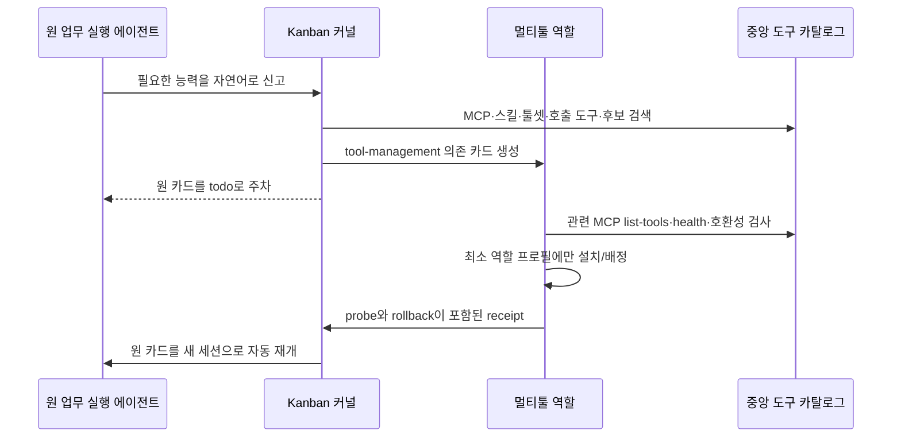

# Hermes Supervisor 운영자 가이드

작성 기준: 2026-07-20 KST<br>
대상 런타임: Spark `/home/zooh/.hermes/hermes-agent`<br>
대상 인터페이스: Telegram, Kanban Web UI, Spark CLI

이 문서는 Hermes의 내부 코드를 설명하는 개발 문서가 아니다. 운영자가
Telegram에서 무엇을 요청하고, Hermes가 누구에게 맡겼으며, 어디에서 진행 상황과
결과를 확인하고, 문제가 생기면 어떻게 실행 에이전트를 바꾸거나 재실행할지를
빠르게 찾기 위한 운용 설명서다.

> 운영 진실은 항상 Spark의 현재 런타임과 Kanban 원장이다. 이 문서에 적힌 모델명,
> 후보 상태 또는 작업 수는 시간이 지나면 바뀔 수 있다. 현재값은 Hermes에게
> `현재 어댑터 현황`, `현재 칸반 현황`, `현재 자동화 현황`이라고 물어 확인한다.

## 1. 30초 요약

Hermes는 일을 직접 수행하는 만능 에이전트가 아니다. 다음 다섯 가지를 담당하는
경량 중앙 컨트롤타워다.

1. 사용자의 자연어 명령을 이해한다.
2. 업무를 고정된 역할 어댑터에 배정한다.
3. Kanban 카드로 실행·댓글·실패·재시도·결과 이력을 남긴다.
4. 역할에 붙는 실제 실행 에이전트를 일회성·임시·영구로 교체한다.
5. 자동화·서비스·역할 실행자의 건강 상태를 heartbeat로 감시한다.

실제 조사, 코드 수정, 운영, 보고서 작성, 검증, 도구 설치는 모두 하위 실행
에이전트가 수행한다. Hermes 본체에는 도메인 MCP를 쌓지 않는다.

## 2. 전체 구조



한 실행 에이전트가 여러 역할 어댑터의 후보가 될 수 있다. 예를 들어 Codex 범용
실행자는 모든 역할의 비상 후보로 붙을 수 있지만, 각 역할의 권한은 역할 계약으로
제한된다. 실행자가 강하다고 해서 임의로 더 넓은 도구나 권한을 얻지는 않는다.

## 3. 용어를 이렇게 이해하면 된다

| 용어 | 뜻 | 운영자가 신경 쓸 점 |
|---|---|---|
| 컨트롤러 | 사용자 말을 이해하고 카드를 만들거나 제어 명령을 내리는 Hermes 본체 | 컨트롤러 모델 변경은 지휘 모델만 바꾼다 |
| 역할 어댑터 | 업무 종류와 권한이 고정된 논리 슬롯 | 총 7개이며 역할 자체는 모델과 분리된다 |
| 실행 에이전트 | 역할 어댑터에 실제로 붙어 일을 수행하는 모델·에이전트 | Codex, OpenCode, Grok 등을 교체 가능하다 |
| 역할 프로필 | 실행 에이전트에 제공되는 격리된 MCP·툴셋 묶음 | 모든 도구를 전부 설치하지 않는다 |
| Kanban 카드 | 하나의 추적 가능한 업무 단위 | 카드 ID로 조회·댓글·재실행·검증한다 |
| receipt | 누가, 어떤 모델·역할·도구로 무엇을 산출했는지 적힌 완료 영수증 | `valid`가 정상 완료의 핵심 증거다 |
| Timeline | 공통 에이전트가 공유하는 맥락·코드 영향·판단·증거 그래프 | Hermes 본체가 직접 보유할 필요는 없다 |
| override | 기본 실행 에이전트 대신 다른 후보를 붙이는 제어 기록 | once·temporary·permanent 세 종류다 |

내부 코드에서는 실행 에이전트를 `worker` 또는 `executor`라고 부를 수 있지만,
운영자 화면에서는 가능한 한 `실행 에이전트`로 표현한다.

### 상태 정보의 우선순위

서로 다른 화면의 숫자가 잠시 다르면 다음 순서로 해석한다.

1. 어댑터 제어판: 현재 controller·binding·override의 실시간 registry
2. Kanban 원장: 현재 카드·실행 회차·receipt의 실시간 상태
3. Supervisor status: 마지막 heartbeat가 만든 관측 snapshot
4. 이 문서: 구조와 운영 계약

Heartbeat snapshot은 다음 정각 갱신 전까지 직전 역할 수나 장애 상태를 보여줄 수
있다. `snapshot age`가 남아 있다면 현재 어댑터 제어판과 모순이 아니라 관측 시점
차이일 수 있다.

## 4. 7개 역할 어댑터

| 역할 | 담당 범위 | 핵심 도구 | 기본 실행 프로필 |
|---|---|---|---|
| 브라우저 조사 | 로그인 페이지, 동적 웹, 원문 근거 수집 | Browser, Web, Advanced Browser, Timeline | browser |
| 코드 변경 | 지정 저장소의 소스 수정과 테스트 | File, Terminal, Kanban, Timeline | general |
| 시장 분석 | 시황·수급·공시·선물·시장 데이터 조사 | FMP/Massive, KIS, KRX/DART, Topstep, Browser, Timeline | market |
| 런타임 운영 | 서비스·cron·watchdog·원하는 상태 복구 | File, Terminal, Cron, Timeline | general |
| 리포트 작성 | 상위 카드와 receipt를 종합해 최종 보고서 조립 | File, Kanban, Timeline | market |
| 독립 검증 | 결과 재조회, 단위·시각·출처·회귀와 완료 조건 판정 | File, Terminal, Kanban, Timeline | general |
| 멀티툴 | MCP·스킬·플러그인·툴셋 검색, 설치, 배정, 검증, rollback | File, Terminal, Web, Skills, Kanban, Timeline | multitool |

위 표의 `기본 실행 프로필`은 기본 바인딩이다. 현재 실제 실행자는 override에 따라
달라질 수 있으므로 모델명은 표에 고정하지 않는다.

### 역할별 중요한 제한

- 브라우저 역할은 근거 수집만 하며 관련 없는 웹 변경을 하지 않는다.
- 코드 역할은 카드에 지정된 저장소·파일·테스트 범위를 넘지 않는다.
- 시장 역할은 노하우 DB와 STOCK 지침을 먼저 읽고, ETF Flow의 의도적 일시정지를
  유지하며, 명시적 주문 카드가 아닌 한 거래를 실행하지 않는다.
- 운영 역할은 지정된 서비스·cron만 변경하고 거래 로직을 암묵적으로 바꾸지 않는다.
- 리포트 역할은 중간 산출물이나 `scheduled` 상태를 완료로 과장하지 않는다.
- 검증 역할은 원 결과와 독립적으로 재조회하고 기존 실패와 신규 회귀를 구분한다.
- 멀티툴 역할은 모든 도구를 모든 프로필에 뿌리지 않는다. 최소 필요 도구만 역할별로
  배정하며, 소스 수정·서비스 재기동·비밀키 변경은 코드/운영 수선 카드로 넘긴다.

## 5. 한 업무가 처리되는 순서

1. 운영자가 Telegram에서 자연어로 요청한다.
2. Hermes 컨트롤러가 역할과 작업 종류를 판단한다.
3. `supervisor_delegate`가 역할 계약에 맞는 Kanban 카드를 만든다.
4. 현재 Telegram 대화가 카드 완료 알림에 구독된다.
5. Dispatcher가 `ready` 카드를 다음 tick에 원자적으로 claim한다.
6. 역할 어댑터에 연결된 실행 에이전트가 새 세션으로 시작한다.
7. 실행 에이전트는 긴 작업 중 heartbeat를 남기고, 필요하면 댓글·하위 카드를 만든다.
8. 작업이 끝나면 사용자용 결과와 receipt를 기록한다.
9. 필요하면 별도의 검증 카드가 원 카드에 연결된다.
10. 완료 결과가 Telegram으로 전달되고 Web UI의 전체 이력에 남는다.

현재 Supervisor 기본 설정의 Dispatcher 주기는 15초다. 따라서 `ready`는 “사람이
실행자를 배정할 때까지 무기한 대기”가 아니라 “다음 자동 claim을 기다리는 상태”다.

## 6. Kanban 상태 읽는 법

| 상태 | 의미 | 보통 다음 동작 |
|---|---|---|
| triage | 사람의 범위·우선순위 판단이 필요 | 댓글 또는 재지정 |
| todo | 상위 의존 카드가 끝나기를 기다림 | 부모 완료 후 자동 ready |
| ready | 실행 가능한 자동 디스패치 대기 | 다음 Dispatcher tick에 claim |
| running | 실행 에이전트가 작업 중 | heartbeat와 댓글 확인 |
| blocked | 입력·권한·반복 실패로 사람 판단 필요 | 원인 해결 후 unblock/재실행 |
| done | 결과와 완료 영수증이 기록됨 | 필요하면 검증 또는 재실행 |
| archived | 이력 보존 상태로 운영 화면에서 정리됨 | 필요할 때 조회 가능 |

`capability_missing`처럼 다른 카드가 먼저 끝나야 하는 경우 원 카드는 `blocked`에
방치되지 않고 `todo`로 이동한다. 멀티툴 의존 카드가 완료되면 원 카드는 자동으로
`ready`가 되고 새 실행 세션에서 다시 시작한다.

## 7. Telegram에서 바로 쓰는 요청문

### 상태 조회

```text
현재 어댑터 현황 보여줘.
현재 칸반에서 ready/running/blocked만 보여줘.
현재 자동화와 7개 서비스 상태를 한 줄로 알려줘.
현재 툴 현황과 고급 브라우징 담당을 보여줘.
t_12345678을 누가 어떤 모델과 역할로 실행했고 receipt가 유효한지 알려줘.
```

상태 질문은 새 카드를 만들지 않고 결정론적 제어판 조회로 바로 답하는 것이
정상이다. 도메인 조사나 변경이 필요한 요청만 카드를 만든다.

### 새 업무

```text
한국장 14:30 시황을 시장 역할에 맡기고, 결과를 독립 검증해줘.
gateway 알림 라우팅 오류를 운영 수선 카드로 고쳐줘.
이 저장소의 오류를 코드 역할에 맡기고 테스트와 변경 파일을 보고해줘.
```

### 실행 에이전트 교체

```text
브라우저 역할을 OpenCode로 1시간 임시 전환해.
시장 역할을 Grok으로 영구 전환해.
이번 카드 t_12345678만 Codex로 실행해.
모든 역할을 긴급하게 Codex로 임시 전환해.
현재 override를 해제하고 기본 바인딩으로 돌려.
```

| 모드 | 범위 | 종료 조건 |
|---|---|---|
| once | 다음 한 카드 또는 지정 카드 한 번 | 사용 후 자동 소진 |
| temporary | 지정 역할 또는 전체 역할 | 지정 시간이 지나면 자동 만료 |
| permanent | 지정 역할 또는 전체 역할 | 운영자가 명시적으로 해제할 때까지 |

컨트롤러 교체와 역할 실행 에이전트 교체는 별개다. Hermes 컨트롤러를 HY3에서
Codex로 바꿔도 7개 역할의 현재 실행 에이전트는 그대로 유지된다.

### 완료된 카드 재실행

```text
t_12345678을 Codex로 다시 실행해. 원본 이력은 보존해.
방금 시장 카드의 방법은 유지하고 브라우저 역할만 Grok으로 바꿔 재실행해.
기존 결과를 폐기하지 말고 검증 카드만 새로 만들어.
```

재실행은 원본 카드를 덮어쓰지 않는다. 새 카드와 실행 계보를 만들고 원 카드 ID,
기존 receipt, 사용한 override를 연결해 비교할 수 있어야 한다.

### 프로젝트·코드 카드 승인·Git 운영

장기 업무는 회사 팀 프로젝트처럼 `프로젝트 → 카드 묶음 → 실행 회차`로 관리한다.
프로젝트 DB와 Kanban DB는 역할이 다르며 어느 한쪽으로 합치지 않는다.

| 원장 | 보존하는 내용 |
|---|---|
| Project DB | `p_*` ID, 단계·마일스톤·다음 행동, `pa_*` 승인, 저장소와 commit/push 감사 이력 |
| Kanban DB | `t_*` 카드, 관계, 역할 셸, claim, 실행 회차, 댓글, 결과, receipt |

화면과 Telegram에서는 프로젝트 카드에 항상 두 식별자를 함께 표시한다.

```text
프로젝트: p_7e4d6ef5
카드: t_12345678
```

코드 역할의 새 카드는 다음 순서를 강제한다.

1. 컨트롤러가 요청 내용을 검증하지만 `t_*` 카드를 아직 만들지 않는다.
2. Project DB에 `pa_*` 승인 요청을 저장하고 프로젝트를 `paused`로 바꾼다.
3. 운영자가 Telegram 또는 Kanban Web UI에서 승인하거나 거절한다.
4. 승인한 경우에만 `t_*` 코드 카드가 한 번 생성되고 프로젝트가 `active`로 돌아간다.
5. 거절하면 카드가 생기지 않으며 거절 이유와 결정자가 Project DB에 남는다.
6. 같은 승인 요청을 다시 처리해도 동일 카드만 반환하며 중복 카드를 만들지 않는다.

따라서 `M1이 끝났으니 M2를 계속해`라는 모델 판단만으로 M2 코드 카드가 발행되면
결함이다. 정상 응답은 `p_*`와 `pa_*`를 보여주고 운영자에게 승인 여부를 묻는 것이다.

실행 중 카드의 범위·목표·완료 조건을 크게 바꾸는 경우에는 채팅 문장을 실행기 안에
끼워 넣지 않는다. `request_direction_change`가 다음 순서를 하나의 컨트롤러 계약으로
수행한다.

1. 후속 카드의 Role Shell, 작업공간, 제목, 완료 조건을 먼저 검증한다.
2. 원본 `t_*`를 `archived`로 전환하고 실행 중인 로컬 프로세스 그룹을 종료한다.
3. Git 작업공간이면 현재 변경분을 원본 카드의 direction-change checkpoint로 commit한다.
   Git 저장소가 아니면 파일은 그대로 보존하고 `not_applicable`을 기록한다.
4. 원본 카드 댓글과 실행 이력에 변경 이유·체크포인트·프로젝트 ID를 남긴다.
5. 후속 작업은 실제 카드가 아닌 `pa_*` 승인 초안으로만 저장하고 프로젝트를 pause한다.
6. 운영자가 이후 별도 메시지나 Web UI에서 승인해야 새 `t_*`가 한 번 생성된다.
7. 새 카드는 원본을 비차단 `references` 관계로 잇는다. 완료되지 않을 원본 때문에
   후속 카드가 `todo`에 갇히지 않으면서도 수개월 뒤 계보를 다시 추적할 수 있다.

방향 전환 요청과 승인을 같은 대화 차례에서 연속 실행하면 안 된다. 먼저 다음 네 값을
보여준 뒤 운영자 결정을 기다린다.

```text
프로젝트: p_12345678
중지·보존 카드: t_12345678
체크포인트: committed · branch=... · sha=...
후속 승인: pa_12345678
```

오탈자 수정이나 기존 완료 조건 안의 작은 보충은 같은 카드의 댓글·재시도 경로를
사용할 수 있다. 산출물, 범위, Role Shell, 완료 조건이 달라지는 변경만 위 전환 절차를
사용한다. 승인 거절 시 원본은 삭제되지 않고 archived 감사 원본으로 남으며 후속 카드는
생성되지 않는다.

Project에 속하지 않은 일반 `t_*` 카드도 실행 중 제어가 가능하다. 운영자가 `중지`라고
하면 `pause_card`가 해당 카드의 로컬 워커 프로세스 그룹만 종료하고 카드를 운영자
대기 상태로 고정한다. 게이트웨이나 다른 실행기는 중지하지 않는다. 이후 동작은 다음과
같다.

- `계속`/`재개`: `resume_card`로 같은 카드 ID를 다시 실행 대기열에 넣는다.
- `이 지시로 바꿔서 계속`: `steer_card`가 먼저 안전 중지를 확인하고 지시를 카드 댓글로
  저장한 뒤 같은 카드 ID를 재개한다.
- 재개된 워커는 기존 작업공간, 종료된 시도 이력, 댓글 지시를 다시 받는다. 이전 OS
  프로세스를 살리는 방식은 아니다.
- 작업자 종료가 아직 확인되지 않았으면 재개하지 않고 `worker termination pending`으로
  남긴다.

Project 카드에서 산출물·범위·Role Shell·완료 조건이 달라지는 큰 변경은 여전히
`steer_card`가 아니라 위의 `request_direction_change`와 별도 `pa_*` 승인을 사용한다.

프로젝트의 `paused`는 완료가 아니다. 새 카드 발행을 막는 durable 운영 게이트다.
실행 중 카드는 먼저 중지·보존한 뒤 프로젝트를 pause해야 한다. `completed`는 열린
카드와 미결 승인 요청이 전혀 없을 때만 사용하는 종결 상태다.

Git 저장소는 프로젝트 생성 시 다음 모드 중 하나를 선택한다.

| 모드 | 동작 |
|---|---|
| `none` | 저장소를 연결하지 않는다 |
| `existing` | 기존 로컬 Git 저장소를 Project DB에 등록한다 |
| `init_local` | 기본 브랜치와 초기 커밋을 갖는 로컬 저장소를 만든다 |
| `github` | 로컬 저장소를 준비하고 private/public GitHub 저장소를 생성·연결·push한다 |

코드 카드는 프로젝트 기본 브랜치가 아니라 카드별 worktree/branch에서 작업한다.
컨트롤러의 Git checkpoint가 변경 파일을 commit하고 Project DB에 카드 ID·branch·SHA를
기록한다. 원격 push는 카드 브랜치에만 허용하며 `main`, `master`, 프로젝트 기본
브랜치 직접 push는 거부한다. 통합·릴리스는 별도의 운영자 승인 게이트다.

프로젝트 생성 예시:

```text
X 자동화 프로젝트를 만들어. 경로는 /srv/x이고 private GitHub 저장소를 연결해.
첫 코드 카드는 아직 만들지 말고 승인 요청 번호를 보여줘.
```

승인과 중지 예시:

```text
프로젝트 p_12345678의 대기 중 코드 카드 승인 요청을 보여줘.
pa_12345678을 승인해.
프로젝트 p_12345678을 pause해. 실행 중 카드는 만들지 마.
```

## 8. 중지 범위는 반드시 구분한다

`/stop`, Kanban 중지, 자동화 중지는 서로 다른 작업이다.

| 요청 | 범위 |
|---|---|
| `/stop` | 현재 Telegram 대화의 진행 중 응답과 그 세션의 백그라운드 하위 작업 |
| `현재 진행 중인 칸반 카드 전체 중지` | durable Kanban의 ready/running/todo 작업 |
| `프로젝트 p_* pause` | 해당 프로젝트의 신규 카드 발행 승인 게이트 |
| `자동화 전체 중지` | cron·watchdog·정기 실행 정의 |
| `Gateway 중지` | Telegram 수신과 내장 Dispatcher를 포함한 서비스 프로세스 |

`/stop`만으로 이미 Dispatcher에 넘긴 모든 Kanban 카드와 cron이 자동 취소된다고
가정하지 않는다. 전체를 멈추고 싶을 때는 다음처럼 범위를 명시한다.

```text
현재 대화 응답, 진행 중인 Kanban 카드, 아직 실행되지 않은 후속 카드까지 모두
중지해. 자동화 정의는 유지하고, 중지한 카드 ID와 최종 상태를 보고해.
```

자동화까지 중지하려면 마지막 문장을 `관련 자동화도 일시정지해`로 바꾼다. 거래,
ETF Flow, thermometer 등 서로 다른 운영 lane을 한 단어 `전체`로 암묵적으로
중지하지 않는다.

## 9. 실행 에이전트 선택과 폴백

각 역할은 하나의 primary와 여러 candidate를 가질 수 있다. 선택 순서는 다음과 같다.

1. 지정 카드의 once override
2. 아직 유효한 temporary/permanent 역할 override
3. 역할의 healthy primary
4. 역할 계약과 도구 조건을 만족하는 healthy candidate

컨트롤러 모델 실패 시 최종 폴백은 Codex 컨트롤러다. 이 폴백은 사용자 명령을
이해하고 역할 카드를 만드는 지휘 계층만 바꾼다. 이미 설정된 역할별 override를
임의로 초기화하지 않는다.

등록 가능한 컨트롤러 계열은 다음과 같다.

| 컨트롤러 계열 | 용도 |
|---|---|
| Codex | 기본 고신뢰 지휘와 최종 폴백 |
| OpenCode HY3 | 저비용 지휘 모델과 OpenCode provider 경로 |
| OpenRouter 모델 | tool-call health gate를 통과한 호환 모델 실험 |
| 로컬 vLLM Gemma | 로컬 모델이 지휘 계약과 tool call을 통과할 때 사용 |

모델명이 존재하는 것과 Hermes 제어 도구를 정상 호출하는 것은 별개다. 컨트롤러
전환은 catalog 확인, 인증, tool-call probe, 감독 계약 검사를 통과한 경우에만
활성화한다. 실패하면 기존 정상 컨트롤러를 유지하거나 Codex로 폴백한다.

코드 수선과 런타임 복구는 일반 업무보다 강한 정책을 사용한다. `오류`, `복구`,
`고쳐`, `수선`, `repair`처럼 실제 변경이 필요한 요청은 Codex 수선 실행자로 고정해
원인 분석·수정·테스트·실런타임 확인을 맡긴다. 경량 컨트롤러가 직접 파일이나
서비스를 고치는 것은 감독 계약 위반이다.

## 10. 도구가 없을 때: Multitool

모든 실행 에이전트에 모든 MCP를 설치하지 않는다. 대신 모든 Kanban 실행 세션에는
가벼운 공통 제어 도구 `kanban_capability_missing`이 있다.



원 실행 에이전트가 정확한 MCP 이름을 몰라도 된다. 예를 들어 “Barchart 로그인
브라우징이 필요하지만 현재 도구에 없다”라고 의미 기반으로 신고한다. 중앙
카탈로그는 설치된 프로필의 MCP·스킬·툴셋·개별 내장 도구·플러그인·실행자 능력을
검색한다.

평상시 상태 조회에서는 모든 MCP를 매번 실기동하지 않는다. 빠른 이름 카탈로그를
먼저 보고, 실제 누락 카드가 들어왔을 때만 관련 MCP의 `initialize/list-tools`를
검사한다. 등록명과 별칭 어디에도 없는 도구는 설치됐다고 추측하지 않고, 멀티툴이
공개 도구 탐색 또는 브라우저 조사 카드로 승격한다.

도구 변경은 실행 중인 모델 세션에 hot-mutate하지 않는다. 정확한 프로필 설정을
백업하고 변경한 다음 반드시 새 실행 세션에서 도구 노출과 health를 검증한다.

외부 실행 에이전트는 모델 이름만 등록한다고 역할 후보가 되지 않는다. 해당 역할의
필수 capability와 MCP/tool probe를 통과해야 한다. 시장·고급 브라우징 후보가 될
수 있는 외부 실행 경로에는 필요에 따라 Timeline, market data, KIS, KRX/DART,
Topstep, Advanced Browser 묶음을 제공하되, 실제 카드에는 역할 계약이 허용한
도구만 노출한다.

## 11. Timeline과 기억 공유

Hermes Timeline Code Map은 컨트롤러의 거대한 장기 기억 파일이 아니다. 공통 실행
에이전트가 다음 내용을 기록하고 서로 이어받는 공유 증거 그래프다.

- 기존 작업의 목표와 판단
- 코드 slice와 영향 파일
- 실행·수정·검증 기록
- 생성된 산출물
- 판단과 증거의 연결 관계
- 그래프 무결성 결과

컨트롤러는 Timeline 전체를 직접 들고 있을 필요가 없다. 컨트롤러는 카드의 맥락,
댓글, receipt, 요약을 보고 지휘하고, 실제 실행 에이전트가 필요한 Timeline context를
불러와 작업을 이어받는다. 이 구조 덕분에 컨트롤러를 다른 모델로 교체해도 업무
기억과 감사 계보가 유지된다.

코드·리포지토리 작업은 `context → code slice → action/output 기록 → post-change
slice → verify_all`을 완료해야 한다. `invalid_count=0`이 아니면 완료로 보고하지
않는다.

## 12. 완료와 독립 검증

정상 완료는 단순히 카드 상태가 `done`인 것보다 강하다.

- 사용자에게 전달할 실제 결과 본문이 있다.
- `result_len=0`이 아니다.
- 실행 역할·실행 에이전트·모델·binding·override가 기록된다.
- 산출물과 데이터 출처가 receipt에 들어간다.
- receipt 검증 상태가 `valid`다.
- 필요한 Timeline 무결성 검사가 통과한다.
- Telegram 구독이 존재하면 완료 알림이 전달된다.

시각, 수치, 단위, 출처 또는 방법론 오류 가능성이 크면 원 실행을 덮어쓰지 않고
별도 `verification` 카드를 만든다. 검증 결과는 `통과`, `정정 필요`, `재실행 필요`를
분명히 구분한다.

## 13. Telegram 알림과 Web UI

새 카드를 만들 때 현재 Telegram 대화에 알림 구독을 자동 연결한다. 정상 흐름은
다음과 같다.

```text
카드 생성 → 자동 디스패치 → running → receipt valid → 완료 결과 Telegram 전송
```

`no_routable_session`이 발생해도 카드 실행 자체가 취소되지는 않는다. 이 경우
알림 구독만 실패한 것이므로 카드 ID를 보존하고 `t_x 결과 확인해줘`라고 조회할 수
있다. 알림 라우팅 복구가 필요하면 operations 수선 카드로 처리한다.

Kanban Web UI에서는 카드별로 다음 항목을 확인할 수 있어야 한다.

- 현재 상태와 역할 어댑터
- 실행 에이전트·모델·binding·override
- 부모/자식 의존 카드
- 댓글과 heartbeat
- 실행 회차와 실패 원인
- 결과, receipt, 산출물
- 재실행·검증 계보

## 14. 두 종류의 heartbeat

### Supervisor heartbeat

- 매시간 정각 KST에 no-agent 스크립트로 실행한다.
- LLM이 장황한 보고서를 만들지 않고 결정론적 상태만 계산한다.
- 서비스 7개, 필수 자동화, 의도적 일시정지, 역할/실행자, receipt 이상을 점검한다.
- 정상일 때는 Telegram에 짧은 한 줄을 보낸다.
- 운영자가 확인한 과거 실패는 계속 신규 장애처럼 반복 경고하지 않는다.

기본 감시 서비스는 다음 7개다.

```text
webapp · autotrade · autotrade2 · shadow · vc · websocket · chart
```

ETF Flow dashboard refresh와 feedback 자동화는 의도적으로 일시정지된 정상 상태다.
Heartbeat가 이를 누락이나 실패로 바꾸거나 자동 재개해서는 안 된다.

### 카드 실행 heartbeat

긴 작업의 실행 에이전트가 claim 만료와 “멈춘 것처럼 보이는 상태”를 막기 위해
Kanban 이벤트로 남긴다. PID가 살아 있다는 뜻만이 아니라 해당 카드의 claim을
유지하고 있다는 증거다.

## 15. 자주 발생하는 문제와 처리

| 증상 | 의미 | 처리 |
|---|---|---|
| `ready`가 보임 | 자동 claim 직전 | Dispatcher와 Gateway가 정상이면 다음 tick까지 기다린다 |
| 오래 running, heartbeat 있음 | 작업은 살아 있음 | 결과를 기다리되 비정상적으로 길면 카드 실행 로그 조회 |
| 오래 running, heartbeat 없음 | 실행 세션 정지 가능성 | operations 수선 카드로 PID·claim·Gateway 점검 |
| `blocked: needs_input` | 사용자 정보 필요 | 카드 댓글 또는 Telegram으로 필요한 값 제공 후 unblock |
| `capability_missing` | 현재 역할에 필요한 도구 없음 | 멀티툴 의존 카드와 자동 재개 여부 확인 |
| `receipt missing/invalid` | 완료 증거 불충분 | 검증 또는 재실행, done으로 신뢰하지 않음 |
| `result_len=0` | 결과 본문 없이 완료 처리됨 | 다른 정상 실행자로 재실행하거나 결과 회수·검증 |
| `no_routable_session` | Telegram 완료 구독 실패 | 카드 실행은 유지, 카드 ID로 조회 후 알림 라우팅 수선 |
| 컨트롤러 모델 실패 | 지휘 모델 호출 실패 | Codex 컨트롤러 폴백, 역할 override는 유지 |
| 실행 에이전트 unhealthy | 해당 후보 배정 금지 | 다른 healthy 후보 사용 또는 operations 수선 |
| 도구명 자체가 미등록 | 중앙 카탈로그에도 정확한 항목 없음 | 멀티툴의 공개 탐색·설치 검토, 설치됐다고 추측 금지 |

## 16. Spark에서 직접 확인하는 최소 명령

Telegram과 Web UI가 우선이며, 아래는 장애 진단용이다.

```bash
ssh spark
cd /home/zooh/.hermes/hermes-agent

# Gateway 서비스 상태
systemctl --user status hermes-gateway.service --no-pager
systemctl --user show hermes-gateway.service \
  -p MainPID -p NRestarts -p ActiveEnterTimestamp --no-pager

# 최근 Gateway 로그
journalctl --user -u hermes-gateway.service -n 100 --no-pager

# Kanban 원장 조회
HERMES_HOME=/home/zooh/.hermes ./venv/bin/hermes kanban list
HERMES_HOME=/home/zooh/.hermes ./venv/bin/hermes kanban show t_12345678
HERMES_HOME=/home/zooh/.hermes ./venv/bin/hermes kanban runs t_12345678

# 현재 소스와 변경 여부
git branch --show-current
git status --short
git log -5 --oneline
```

Kanban SQLite DB나 역할 registry를 사람이 직접 수정하지 않는다. 정상 제어면,
CLI 또는 수선 카드를 사용해 변경해야 감사 이력과 rollback이 남는다.

## 17. 소스 오브 트루스와 배포

- 실제 운영 소스: Spark `/home/zooh/.hermes/hermes-agent`
- 실제 운영 설정: Spark `/home/zooh/.hermes`
- Gateway: `hermes-gateway.service`
- 원격 백업/공유: private GitHub `JUNJOONHWAN/hermes-agent-spark`
- Mac 작업 사본은 편집·검토용이며 실런타임 상태의 근거가 아니다.

정상 변경 순서:

1. 요청 범위와 영향 파일을 확인한다.
2. 코드 역할 또는 Codex 수선 역할이 변경한다.
3. 관련 테스트는 `scripts/run_tests.sh`로 실행한다.
4. Timeline의 post-change slice와 `verify_all`을 통과한다.
5. Spark 소스에 반영한다.
6. 필요한 서비스만 재기동한다.
7. Spark에서 실기동을 검증한다.
8. Spark `main`을 private GitHub에 push한다.

## 18. 운영자가 기억할 다섯 문장

1. Hermes는 직접 일하지 않고 판단·위임·추적한다.
2. 모든 의미 있는 업무는 Kanban 카드와 receipt를 남긴다.
3. 역할 어댑터와 실제 실행 에이전트는 분리되어 자유롭게 교체할 수 있다.
4. 모든 도구를 모두에게 설치하지 않고, 부족하면 멀티툴이 역할별로 보강한다.
5. 현재 상태는 문서가 아니라 Spark 런타임·Kanban·heartbeat 조회값이 진실이다.

## 부록 A. 내부 제어면 대응표

일반 운영자는 내부 도구명을 외울 필요가 없다. 장애 분석이나 개발 시 참고한다.

| 사용자 의도 | 내부 제어면 |
|---|---|
| 현재 전체 상태 | `supervisor_status` |
| 어댑터 현황·교체·재실행 | `supervisor_adapter` |
| 역할 계약 조회 | `supervisor_roles` |
| 업무 위임 | `supervisor_delegate` |
| 자동화 상태 | `supervisor_automation` |
| 도구 누락 신고 | `kanban_capability_missing` |
| 카드 진행 유지 | `kanban_heartbeat` |
| 카드 완료 | `kanban_complete` + valid receipt |

## 부록 B. 문서 갱신 기준

다음 항목이 바뀌면 이 문서도 함께 갱신한다.

- 역할 어댑터 수 또는 역할 계약
- controller fallback 정책
- override의 범위·만료 방식
- Kanban 상태 전이와 완료 receipt 계약
- heartbeat 감시 서비스·자동화 정책
- Multitool 도구 발견·설치·rollback 흐름
- Spark 운영 경로, systemd unit, GitHub 원격 저장소

현재 모델명, 일시적 override, 카드 수, enabled executor 수처럼 자주 바뀌는 값은
문서에 고정하지 않고 실시간 조회 문구를 유지한다.
